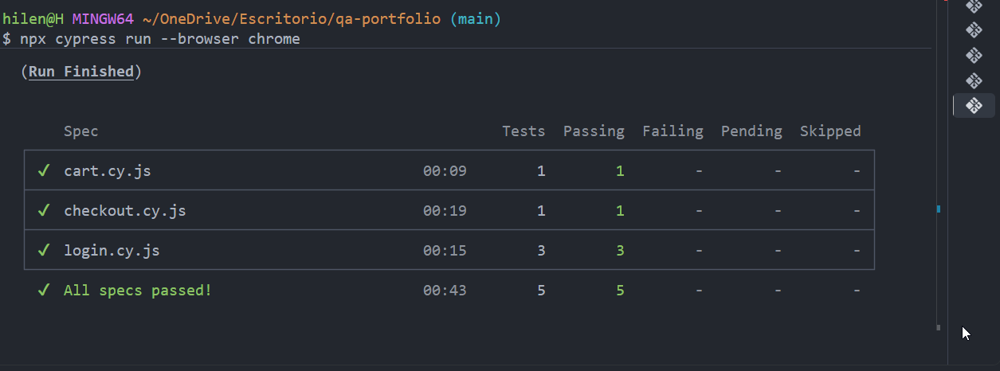
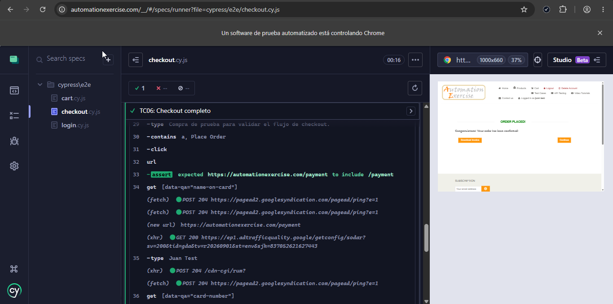
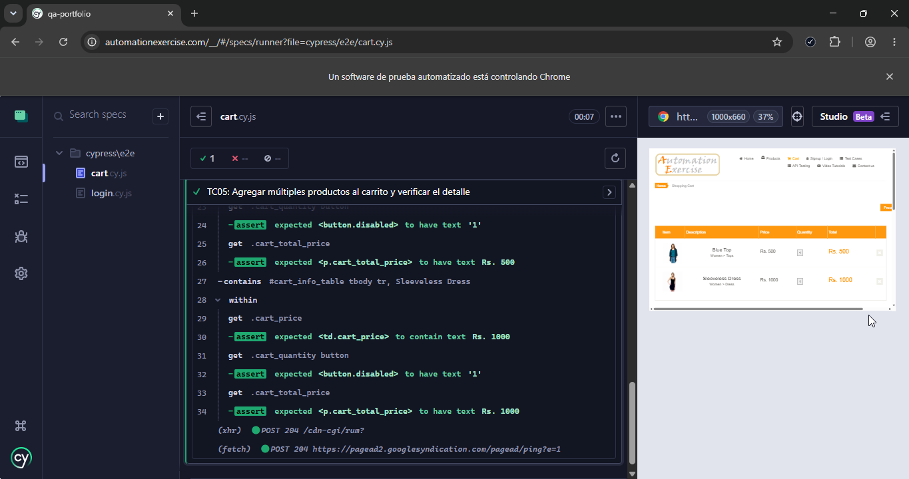
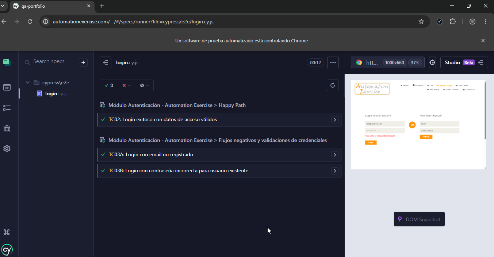

# QA Portfolio — Automation Exercise

[](#)
[](#)
[](#)

## 📋 Sobre este proyecto

Este proyecto de QA fue desarrollado sobre el sitio de práctica *Automation Exercise*, y cubre el ciclo completo de testing: Diseño y ejecución de casos de prueba manuales, reporte de bugs y automatización end-to-end (E2E) con Cypress.

El objetivo fue simular el trabajo de un QA dentro de un equipo real. Para ello, primero diseñé y ejecuté los casos de prueba de forma manual, documenté los bugs hallados y luego seleccioné y automaticé los flujos esenciales (Login, Carrito y Checkout). Para mantener el código organizado, usé Fixtures JSON para los datos de prueba y Custom Commands para reutilizar acciones comunes.

---

## 🎯 Alcance
* 📝 **Testing manual:** Diseño y ejecución de casos de prueba en registro, login, catálogo, carrito y checkout.

* 🐛 **Reporte de bugs:** Documentación detallada de incidentes con pasos de reproducción, severidad, prioridad y capturas.

* 🤖 **Automatización E2E:** Automatización de flujos de Login, Carrito y Checkout con Cypress, incluyendo casos positivos, negativos y validaciones funcionales.

* 📸 **Evidencias:** Capturas de pantalla de los bugs detectados y de las ejecuciones de los tests automatizados.

---

## 🛠️ Herramientas utilizadas

* **Testing manual:** Casos de prueba, reportes de bugs y evidencias.
* **Automatización E2E:** Cypress 16+, JavaScript (ES6).
* **Organización de los tests:** Fixtures JSON para los datos de prueba y Custom Commands (`cy.login`) para reutilizar acciones comunes.
* **Control de versiones:** Git y GitHub.

---

## 🐛 Bugs reportados

| ID | Título | Severidad | Prioridad |
| :--- | :--- | :---: | :---: |
| **BUG-01** | Checkout acepta tarjetas vencidas | 🔴 Alta | 🔴 Alta |
| **BUG-02** | Checkout acepta números de tarjeta inválidos | 🔴 Alta | 🔴 Alta |
| **BUG-03** | Checkout 404 con total negativo | 🔴 Crítica | 🔴 Alta |
| **BUG-04** | Campo cantidad sin límites | 🟡 Media | 🟡 Media |
| **BUG-05** | Cantidad solo editable desde vista de producto | 🟡 Media | 🟡 Media |
| **BUG-06** | Registro permite contraseñas débiles | 🔴 Alta | 🔴 Alta |
| **BUG-07** | Registro acepta emails sin dominio válido | 🟡 Media | 🟡 Media |
| **BUG-08** | El campo "Zipcode" acepta un solo dígito | 🟡 Media | 🟡 Media |
| **BUG-09** | El campo "Mobile Number" acepta un solo dígito | 🟡 Media | 🟡 Media |

📎 [Ver todos los reportes de bugs](manual-testing/bug-reports/)

---

## 🤖 Cobertura de Automatización (Cypress)

A partir de los casos de prueba manuales, seleccioné algunos escenarios para automatizarlos con Cypress, principalmente los flujos de Login, Carrito y Checkout.

| Módulo | Test Case | Tipo | Descripción |
| :--- | :--- | :--- | :--- |
| **Login** | TC02 | Happy Path | Login exitoso con credenciales válidas y persistencia de sesión |
| **Login** | TC03A | Negativo | Validación de rechazo con email no registrado |
| **Login** | TC03B | Negativo | Validación de rechazo con contraseña incorrecta |
| **Carrito** | TC05 | Funcional | Agregado múltiple de ítems y validación de totales en tabla |
| **Checkout** | TC06 | Happy Path (E2E) | Flujo completo: selección, checkout, validación de total (Rs. 1500) y pago |

---

## ▶️ Cómo ver y ejecutar este proyecto

Asegurate de tener **Node.js** instalado. Abrí la terminal en la raíz del proyecto y ejecutá:

```bash
# Instalar dependencias
npm install

# Abrir Cypress en modo interactivo
npx cypress open

# Ejecutar la suite completa por consola en Chrome
npx cypress run --browser chrome
````

---

## 📊 Resultados de la Automatización

✅ **5 de 5 tests pasaron sin errores (100% de ejecución exitosa en Chrome).**

### Evidencia de la ejecución completa



### Evidencias por flujo

#### 🛒 Checkout — TC06: Flujo completo de compra y confirmación



#### 📦 Carrito — TC05: Agregado múltiple y validación de totales



#### 🔑 Login — TC02, TC03A y TC03B: Autenticación



---

## 📁 Estructura del repositorio

```text
qa-portfolio/
├── README.md
├── .gitignore
│
├── manual-testing/
│   ├── test-cases/
│   │   ├── cart/
│   │   ├── contact/
│   │   ├── login/
│   │   ├── products/
│   │   └── checkout/
│   └── bug-reports/
│
├── automation/
│   └── evidencia/
│       ├── cart/
│       │   └── cart_execution.png
│       ├── checkout/
│       │   └── checkout_execution.png
│       ├── login/
│       │   └── login_execution.png
│       └── terminalRun.png
│
├── cypress/
│   ├── fixtures/
│   │   ├── checkout.json
│   │   ├── login.json
│   │   └── products.json
│   │
│   ├── e2e/
│   │   ├── cart.cy.js
│   │   ├── checkout.cy.js
│   │   └── login.cy.js
│   │
│   └── support/
│       ├── commands.js
│       └── e2e.js
│
├── cypress.config.js
├── package.json
└── package-lock.json
```

> `node_modules/` no se incluye en el repositorio, ya que las dependencias pueden instalarse mediante `npm install`.

---

## 🙋🏻‍♀️ Sobre mí

Me interesa el testing de software, con formación práctica en **pruebas manuales**, **reporte de bugs** y **automatización E2E con Cypress**.

Este repositorio es la primera parte de mi portfolio de QA. La segunda está enfocada en API Testing y validación de datos con SQL:  [backend-testing](https://github.com/hilenortiz/backend-testing)

Estoy buscando mi primera oportunidad formal en QA, con ganas de seguir aprendiendo dentro de un equipo real.

📫 **Contacto:** [LinkedIn](https://www.linkedin.com/in/hilenortiz) • [Email](mailto:hilenortiz@gmail.com)


