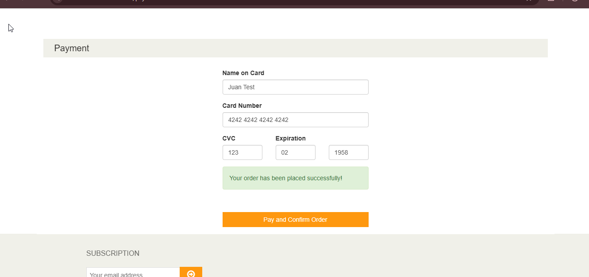
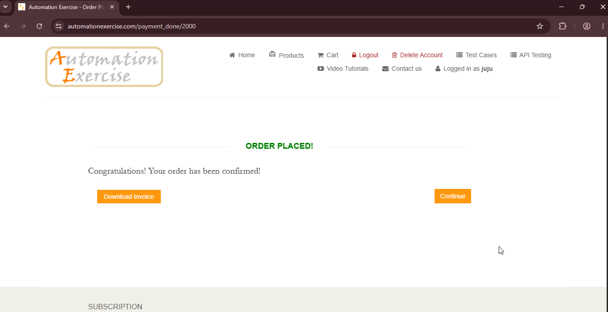

# BUG-01: Checkout acepta tarjetas vencidas

## Descripción
En el flujo de pago, el sistema permite completar una orden utilizando una tarjeta cuya fecha de expiración ya pasó. Esto podría generar órdenes aprobadas con datos de pago inválidos.

## Pasos para reproducir
1. Agregar un producto al carrito.
2. Hacer clic en "Proceed To Checkout".
3. Completar los datos de envío y facturación.
4. Llenar los datos de pago con:
- *Name on Card:* `Juan Test`
- *Card Number:* `4242 4242 4242 4242`
- *CVC:* `123`
- *Expiration Month:* `02`
- *Expiration Year:* `1958`
5. Hacer clic en "Pay and Confirm Order".

## Resultado esperado
El sistema debería mostrar un mensaje de error indicando que la fecha de expiración no es válida (ej: "The expiration date is invalid").

## Resultado obtenido
El sistema procesó el pago y confirmó la orden sin validar la fecha de expiración. Se mostró el mensaje "Your order has been placed successfully!" y se confirmó la orden.

## Evidencia

## Ambiente
- *Navegador:* Chrome 152
- *URL:* `https://www.automationexercise.com/payment`
- *Fecha:* 03/09/2026

## Severidad
🔴 Alta. Permite completar una transacción con datos de pago inválidos.

## Prioridad
🔴 Alta.

## Reproducibilidad
Siempre, ocurre en todos los intentos con una fecha de expiración en el pasado.

## Casos de prueba relacionados
- TC06 — Checkout completo

## Contexto adicional
Este bug junto con el BUG-02 sugiere una falta general de validación en el flujo de pago.