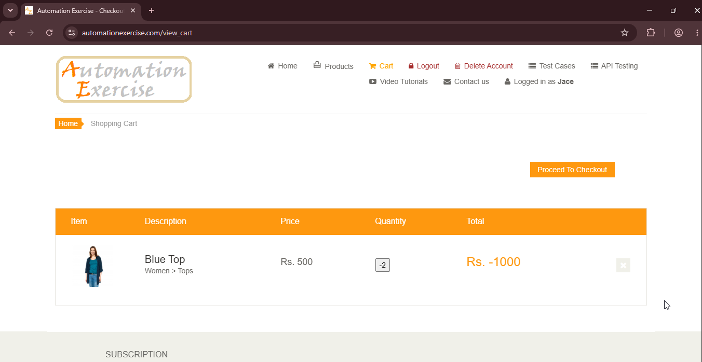
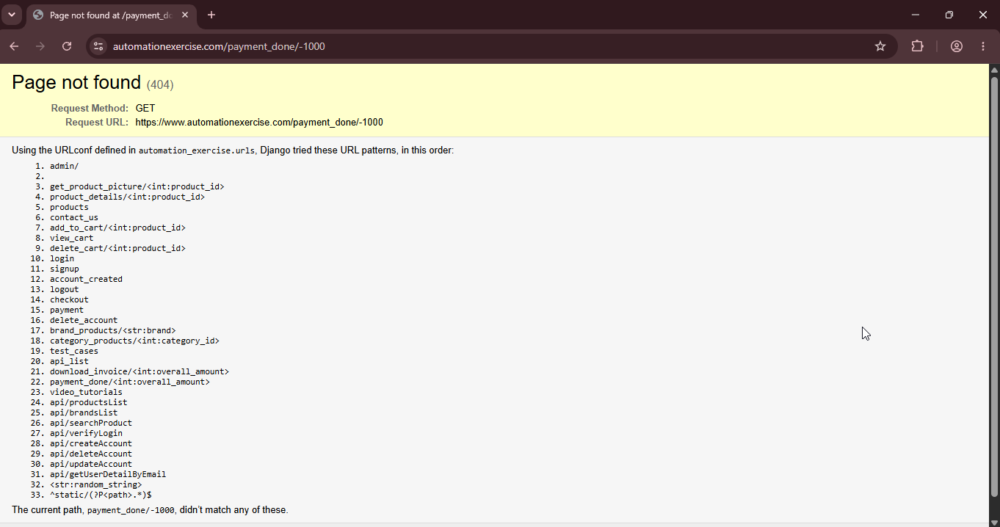

# BUG-03: Checkout 404 con total negativo

## Descripción
Si se modifica la cantidad de un producto a un valor negativo desde la página de detalles, el total del carrito se vuelve negativo. Al intentar proceder al checkout, el sistema redirige a una URL inexistente generando un error 404.

## Pasos para reproducir
1. Navegar a `https://www.automationexercise.com/products`.
2. Agregar un producto al carrito (ej: "Blue Top" – Rs. 500).
3. Ir a la página de detalles del producto "/product_details/1".
4. Cambiar la cantidad a `-2`.
5. Hacer clic en "Add to cart".
6. Ir al carrito: el total será negativo.
7. Hacer clic en "Proceed To Checkout".

## Resultado esperado
El sistema debería mostrar un mensaje de error indicando que la cantidad no es válida. El checkout no debería permitir continuar con un total negativo.

## Resultado obtenido
El sistema permitió ingresar la cantidad "-2" en el carrito y al continuar al checkout con el total negativo, redirigió a `https://www.automationexercise.com/payment_done/-1000`, que devolvió un error 404. La página no se encontró.

## Evidencia

## Ambiente
- *Navegador:* Chrome 152
- *URL:* `https://www.automationexercise.com/payment_done/-1000`
- *Fecha:* 03/09/2026

## Severidad
🔴 Crítica. Rompe el flujo de compra

## Prioridad
🔴 Alta. Afecta la integridad del proceso de pago.

## Reproducibilidad
Siempre. Ocurre cada vez que se intenta proceder al checkout con un total negativo.

## Casos de prueba relacionados
- TC06 — Checkout completo