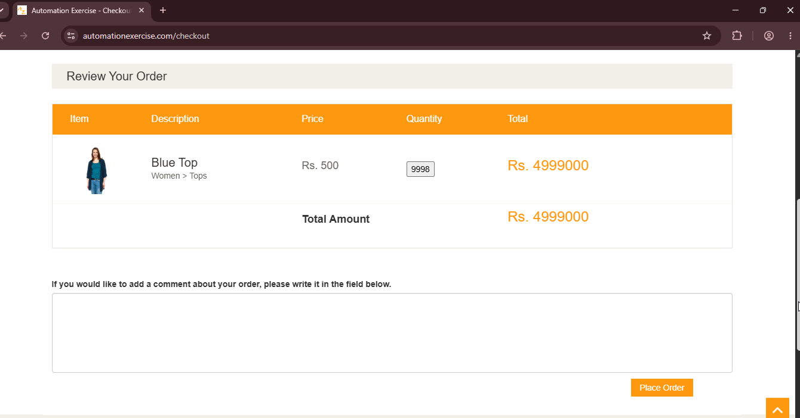

# BUG-04: Campo cantidad sin límites

## Descripción
En la página de detalles del producto, el campo "Quantity" permite ingresar números negativos (ej: -2) y números extremadamente altos (ej: 10000), sin ningún tipo de validación.

## Pasos para reproducir
1. Navegar a `https://www.automationexercise.com/product_details/1`.
2. Ingresar un número negativo (ej: -2) y hacer clic en "Add to cart".
3. Observar el total del carrito.
4. Repetir con un número muy alto (ej: 10000).

## Resultado esperado
El sistema debería limitar la cantidad a valores positivos y razonables (ej: mínimo 1, máximo 100).

## Resultado obtenido
El sistema permitió agregar productos con cantidad `-2` y `10000`. Con la cantidad `-2`, el total del carrito se volvió negativo, mientras que con la cantidad `10000` el carrito subio. Obteniendo como total en el checkout `Rs. 4,999,000` para una cantidad de `9998` (10000-2). No se mostró ningún mensaje de error en ningún paso.

## Evidencia

## Ambiente
- *Navegador:* Chrome 152
- *URL:* `https://www.automationexercise.com/product_details/1`
- *Fecha:* 03/09/2026

## Severidad
🟡 Media. No bloquea la funcionalidad pero evita datos invalidos y posibles inconsistencias.

## Prioridad
🟡 Media.

## Reproducibilidad
Consistente. Ocurre al ingresar cantidades no válidas.

## Casos de prueba relacionados
- TC06 — Checkout completo