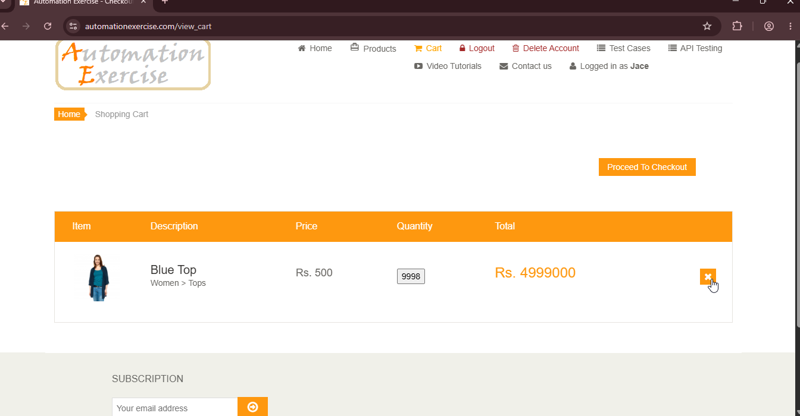

# BUG-05: Cantidad editable solo desde vista de producto

## Descripción
En la página del carrito, el usuario no puede modificar la cantidad de un producto. Solo puede hacerlo desde la página de detalles del producto, lo que obliga a salir del flujo de compra y afecta la experiencia de usuario.

## Pasos para reproducir
1. Navegar a `https://www.automationexercise.com/products`.
2. Agregar un producto al carrito.
3. Ir a la página del carrito.
4. Intentar cambiar la cantidad del producto.

## Resultado esperado
El usuario debería poder modificar la cantidad directamente desde el carrito.

## Resultado obtenido
En la página del carrito no hay ningún campo para modificar la cantidad de los productos seleccionados. La única opcion disponible es eliminar el producto (ícono "X"). Y para cambiar la cantidad, el usuario debe salir del carrito, ir a la página de detalles del producto y modificarla desde allí.

## Evidencia

## Ambiente
- *Navegador:* Chrome 152
- *URL:* `https://www.automationexercise.com/view_cart`
- *Fecha:* 03/09/2026

## Severidad
🟡 Media. No bloquea la compra pero afecta la usabilidad.

## Prioridad
🟡 Media.

## Reproducibilidad
Consistente. Ocurre siempre en la página del carrito.

## Casos de prueba relacionados
- TC05 — Agregar productos al carrito