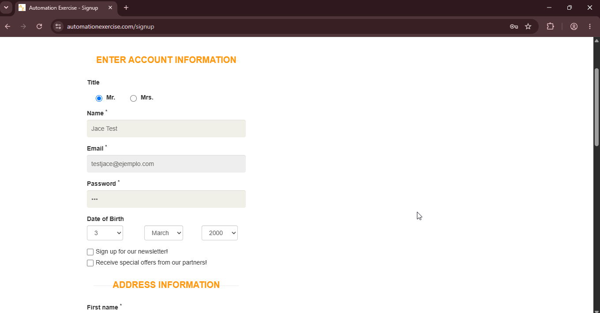
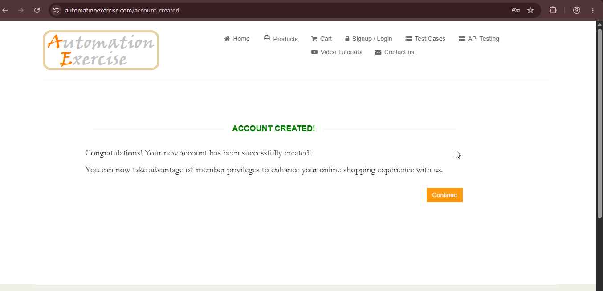

# BUG-06: Registro permite contraseñas débiles

## Descripción
En el formulario de registro, el campo "Password" permite ingresar contraseñas extremadamente débiles, como "123" o "password", sin ninguna validación de complejidad o longitud mínima.

## Pasos para reproducir
1. Navegar a `https://www.automationexercise.com/login`.
2. En la sección "New User Signup!", completar:
- *Name:* `Jace Test`
- *Email:* `testjace@ejemplo.com`
3. Hacer clic en "Signup" para avanzar a "Enter Account Information".
4. Completar el resto de los campos con datos válidos.
5. En el campo "Password", ingresar: `123`.
6. Hacer clic en "Create Account".

## Resultado esperado
El sistema debería mostrar un mensaje de error indicando que la contraseña es demasiado débil (ej: "Password must be at least 8 characters long").

## Resultado obtenido
(Pendiente de ejecutar)

## Evidencia

## Ambiente
- *Navegador:* Chrome 152
- *URL:* `https://www.automationexercise.com/signup`
- *Fecha:* 03/09/2026

## Severidad
🔴 Alta. Afecta la seguridad de las cuentas de los usuarios.

## Prioridad
🔴 Alta. Permite contraseñas que pueden ser fácilmente vulneradas.

## Reproducibilidad
Reproducible de forma consistente.

## Casos de prueba relacionados
- TC01 — Registro exitoso de usuario con datos válidos