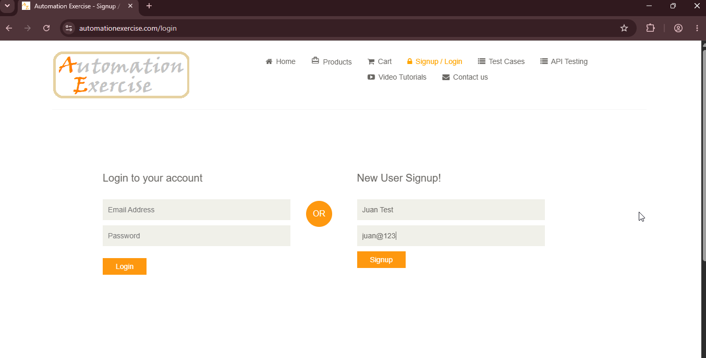
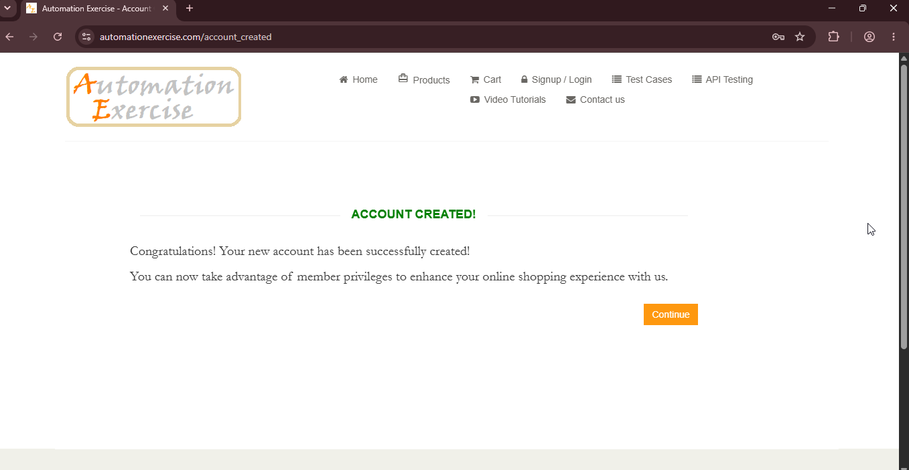

# BUG-07: Registro acepta emails sin dominio válido

## Descripción
El formulario de registro permite crear una cuenta utilizando un email con un dominio que no tiene extensión válida (ej: `juan@123`), sin validar el formato estándar de una dirección de email.

## Pasos para reproducir
1. Navegar a `https://www.automationexercise.com/login`.
2. En la sección "New User Signup!", completar:
- *Name:* `Juan Test`
- *Email:* `juan@123`
3. Hacer clic en "Signup" y completar el resto del formulario.
4. Hacer clic en "Create Account".

## Resultado esperado
El sistema debería rechazar el email por no tener un dominio con extensión válida.

## Resultado obtenido
El sistema aceptó el email "juan@123" y permitió completar el registro exitosamente, mostrando el mensaje "ACCOUNT CREATED!".

## Evidencia

## Ambiente
- *Navegador:* Chrome 152
- *URL:* `https://www.automationexercise.com/signup`
- *Fecha:* 03/09/2026

## Severidad
🟡 Media. Permite registrar cuentas con datos de contacto inválidos.

## Prioridad
🟡 Media.

## Reproducibilidad
Siempre.

## Casos de prueba relacionados
- TC01 — Registro exitoso de usuario con datos válidos