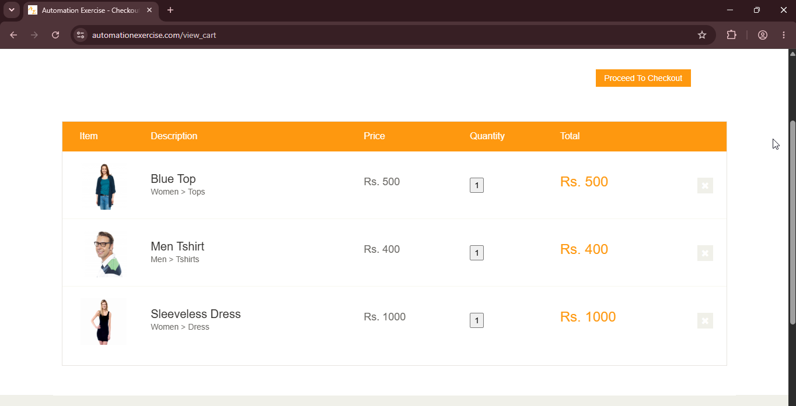
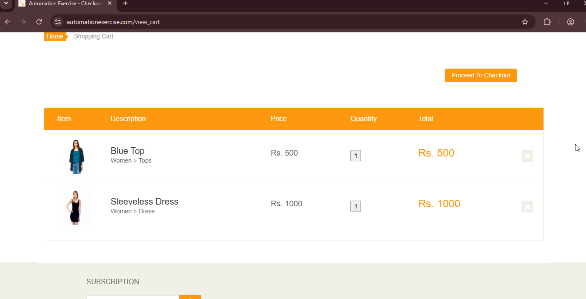

# TC09: Eliminar productos del carrito

## Descripción
Verificar que el usuario puede eliminar un producto del carrito y que el listado se actualiza correctamente, sin afectar a los productos restantes.

**Tipo:** Camino feliz (happy path)

## Precondiciones
- Debe haber al menos 2 productos en el carrito.
- No es necesario estar logueado.

## Datos de Prueba
- *Productos iniciales:* Blue Top (Rs. 500), Men-Tshirt (Rs. 400), Sleeveless Dress (Rs. 1000)
- *Producto a eliminar:* Men-Tshirt

## Pasos
1. Agregar los 3 productos de prueba al carrito.
2. Ir a "Cart".
3. Hacer clic en el ícono (X) de eliminar sobre "Men Tshirt".

## Resultado Esperado
1. "Men Tshirt" se elimina de la tabla del carrito.
2. Los productos restantes (Blue Top y Sleeveless Dress) permanecen sin cambios (con su nombre, precio y cantidad correctos).

## Resultado Obtenido
"Men Tshirt" se eliminó correctamente de la tabla al hacer clic en el ícono (X). Los productos restantes permanecieron sin cambios, con su precio, cantidad y subtotal intactos.

## Evidencia

## Estado
✅ Aprobado