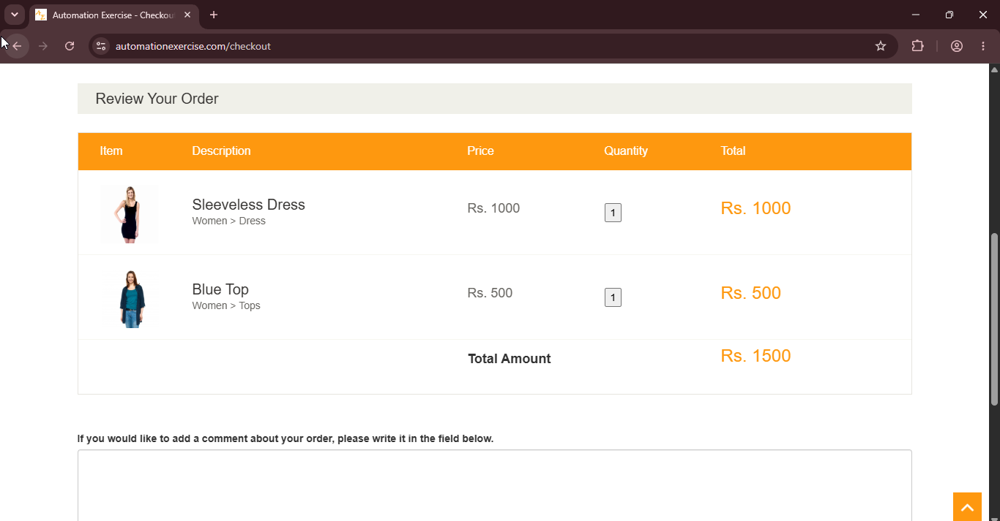
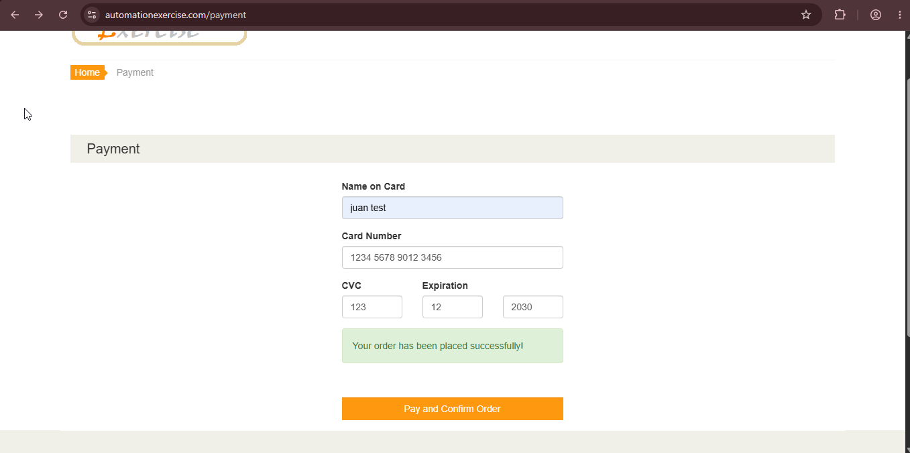
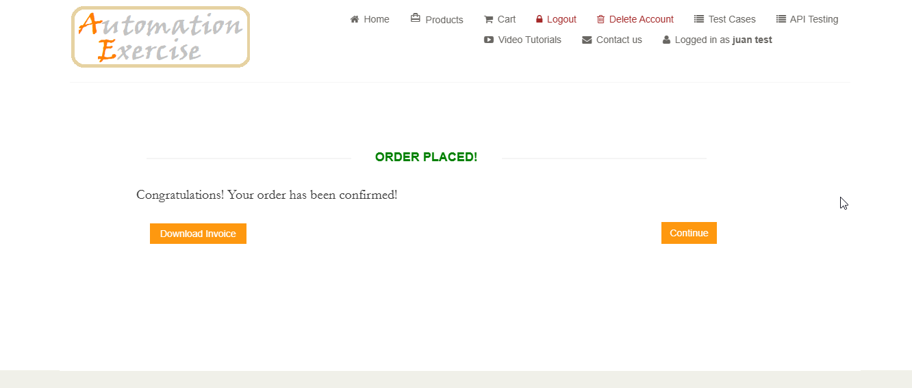

# TC06: Checkout completo

## Descripción
Verificar que un usuario registrado puede completar el proceso de compra exitosamente, visualizando el total de la orden, confirmando los datos de envío y facturación, y finalizando el pago.

**Tipo:** Camino feliz (happy path)

## Precondiciones
- El usuario debe estar registrado y logueado (ej: `test@ejemplo.com`).
- Tener al menos un producto agregado al carrito.

## Datos de Prueba
- *Producto 1:* Blue Top (Precio: Rs. 500 | Cantidad: 1)
- *Producto 2:* Sleeveless Dress (Precio: Rs. 1000 | Cantidad: 1)
- *Total esperado:* Rs. 1500
- *Comentario:* "Compra de prueba para validar el flujo de checkout."
- **Datos de pago:**
  - *Name on Card:* `Juan Test`
  - *Card Number:* `1234 5678 9012 3456`
  - *CVC:* `123`
  - *Expiration Date:* `12/30`

## Pasos
1. Navegar a la página principal (`https://www.automationexercise.com`).
2. Agregar "Blue Top" al carrito y continuar comprando.
3. Agregar "Sleeveless Dress" al carrito.
4. Hacer clic en el botón "View Cart" en el modal de confirmación.
5. Hacer clic en el botón "Proceed To Checkout".
6. Verificar que los datos de envío y facturación coinciden con los del registro.
7. Agregar un comentario en el área de texto.
8. Hacer clic en el botón "Place Order".
9. Completar los datos de pago.
10. Hacer clic en el botón "Pay and Confirm Order".

## Resultado Esperado
1. Se visualiza el mensaje de éxito: "Congratulations! Your order has been confirmed!".
2. El total de la orden coincide con la suma de ambos productos: **Rs. 1500**.
3. El usuario recibe un número de orden o confirmación del pedido.

## Resultado Obtenido
- El checkout mostró correctamente ambos productos en "Review Your Order" con el **Total Amount: Rs. 1500** (coincidiendo con la suma esperada de los productos anteriormente seleccionados).
- Se completaron los datos de pago sin inconvenientes ("Your order has been placed successfully!")
- Al confirmar se visualizó el mensaje "ORDER PLACED! Congratulations! Your order has been confirmed!".
 
## Evidencia

 
## Estado
✅ Aprobado