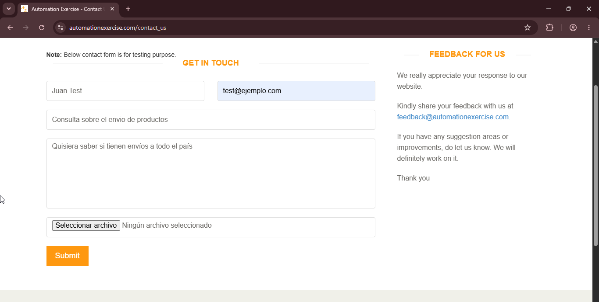
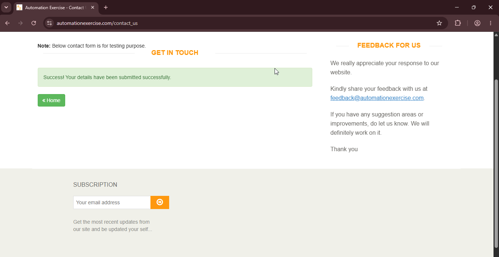

# TC08: Formulario de contacto con datos validos

## Descripción
Verificar que el usuario puede enviar un mensaje exitosamente a través del formulario de contacto.

**Tipo:** Camino feliz (happy path)

## Precondiciones
- Tener acceso a la página principal del sitio.
- No es necesario estar logueado.

## Datos de Prueba
- *Name:* `Juan Test`
- *Email:* `test@ejemplo.com`
- *Subject:* `Consulta sobre el envio de productos`
- *Message:* `Quisiera saber si tienen envíos a todo el país.`

## Pasos
1. Navegar a la página principal (`https://www.automationexercise.com`).
2. Hacer clic en "Contact us" en el header (barra de navegación superior).
3. Completar el campo "Name" con el nombre de prueba.
4. Completar el campo "Email" con el email de prueba.
5. Completar el campo "Subject" con el asunto de prueba.
6. Completar el campo "Message" con el mensaje de prueba.
7. Hacer clic en el botón "Submit".

## Resultado Esperado
1. Se visualiza el mensaje de éxito: "Success! Your details have been submitted successfully.".
2. El usuario es redirigido a la página principal al hacer clic en el botón "Home".

## Resultado Obtenido
El formulario se envió correctamente con los datos anteriormente definidos. Apareció un alert del navegador solicitando confirmar el envío,se aceptó. Tras confirmarlo, se visualizó el mensaje de éxito "Success! Your details have been submitted successfully.", tal como se esperaba.
 
## Evidencia

## Estado
✅ Aprobado