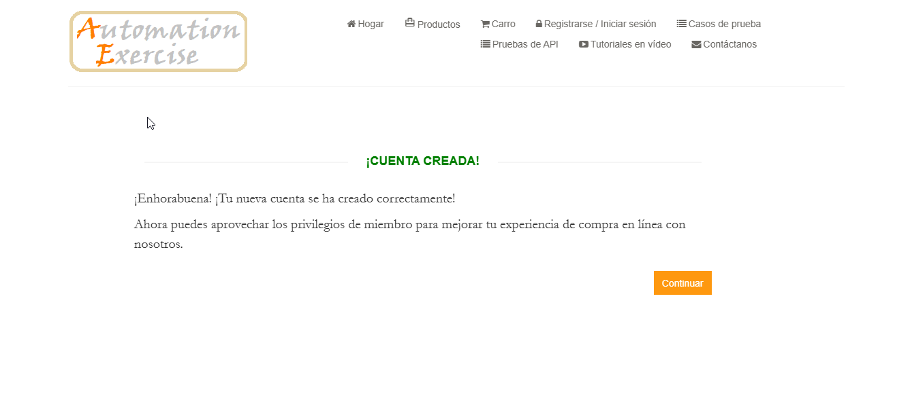

# TC01: Registro exitoso de usuario con datos válidos

## Descripción
Verificar que un usuario nuevo puede registrarse exitosamente en el sitio usando un correo electrónico válido y completando el formulario de datos personales y de contacto.

**Tipo:** Camino feliz (happy path)

## Precondiciones
- El usuario no debe estar registrado previamente en el sistema.
- Tener acceso a la página de inicio de sesión/registro (`https://www.automationexercise.com/login`).

## Datos de Prueba
- *Name:* `Juan Test`
- *Email:* `test@ejemplo.com`
- *Password:* `Password123`
- *Date of Birth:* `02/09/1990`
- *First Name:* `Juan`
- *Last Name:* `Test`
- *Company:* `QA company`
- *Address:* `Calle Falsa 123`
- *Country:* `Canada`
- *State:* `Ontario`
- *City:* `Ottawa`
- *Zipcode:* `K1A 0A9`
- *Mobile Number:* `6135551234`

## Pasos
1. Navegar a la página principal del sitio (`https://www.automationexercise.com`).
2. Hacer clic en el botón "Signup / Login".
3. En la sección "New User Signup!", completar el campo "Name" con el nombre de prueba (`Juan Test`).
4. Completar el campo "Email" con el email de prueba (`test@ejemplo.com`).
5. Hacer clic en el botón "Signup".
6. En la página "Enter Account Information", completar el formulario con los *Datos de Prueba*.
7. Hacer clic en el botón "Create Account".

## Resultado Esperado
1. Se visualiza el mensaje de éxito "ACCOUNT CREATED!" con el texto de confirmación.
2. El nombre del usuario ("Juan Test") aparece en la barra de navegación, indicando sesión iniciada.

## Resultado Obtenido
El registro fue exitoso. Se visualizó el mensaje "ACCOUNT CREATED!" y la confirmación del registro.

## Evidencia

## Estado
✅ Aprobado