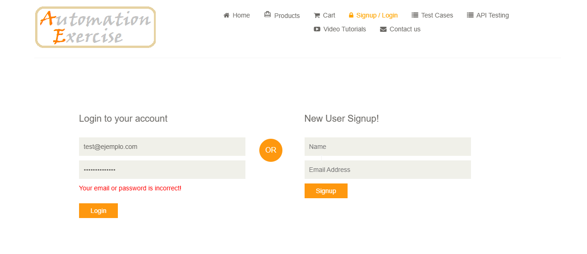

# TC03B: Login con contraseña incorrecta

## Descripción
Verificar que el sistema muestra un mensaje de error cuando se ingresa una contraseña incorrecta para un email registrado.

## Precondiciones
- El usuario debe estar registrado previamente (ej: `test@ejemplo.com`).
- Tener acceso a la página de inicio de sesión.

## Datos de Prueba
- *Email:* `test@ejemplo.com`
- *Contraseña:* `passincorrecta`

## Pasos
1. Navegar a la página principal (`https://www.automationexercise.com`).
2. Hacer clic en "Signup / Login".
3. Completar el campo "Email" con el email de prueba.
4. Completar el campo "Password" con la contraseña de prueba.
5. Hacer clic en "Login".

## Resultado Esperado
1. El sistema NO inicia sesión.
2. Se muestra el mensaje: "Your email or password is incorrect!".

## Resultado Obtenido
El sistema no inició sesión y se mostró el mensaje de error esperado: "Your email or password is incorrect!".

## Evidencia

## Estado
✅ Aprobado