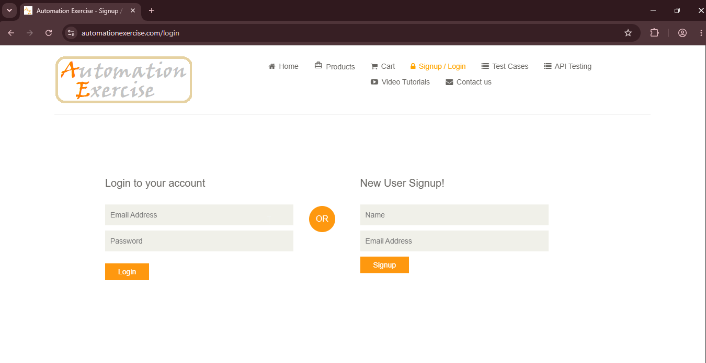

# TC07: Logout 

## Descripción
Verificar que un usuario logueado puede cerrar sesión correctamente.

**Tipo:** Camino feliz (happy path)

## Precondiciones
- El usuario debe estar logueado

## Pasos
1. Con sesión iniciada, hacer clic en "Logout" en el header.

## Resultado Esperado
1. El sistema cierra la sesión y redirige a la pantalla de login.
2. Las opciones de usuario logueado (Logout, Delete Account) desaparecen del header.

## Resultado Obtenido
El sistema cerró la sesión correctamente y redirigió a /login. En el header volvió a aparecer "Signup / Login", y las opciones de usuario logueado (Logout y Delete Account) ya no se visualizan.
 
## Evidencia

## Estado
✅ Aprobado